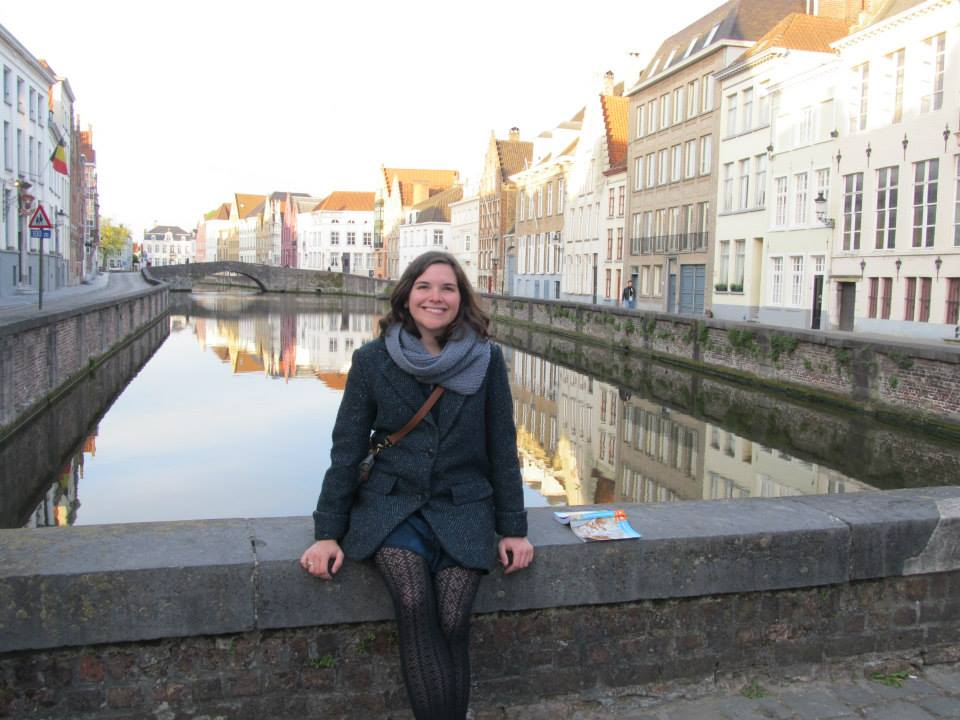

# hw01

# Marie's Biography
I am a graduate student in the MAPSS program at the University of Chicago, where I am concentrating in sociology. 

### Education and Work Experience
I received my BA in English from Grinnell College in Iowa. After graduating from Grinnell in 2012, I moved back to my hometown of Chicago, where I was the Communications and Development Coordinator at Working Bikes, a nonprofit that donates used bicycles locally and globally. After three years at Working Bikes, I moved to Salt Lake City, Utah, where I served as the Donor Services Manager at the Community Foundation of Utah before beginning MAPSS. 

### Hobbies and Interests
I love to:

* Bake, especially recipes from [Smitten Kitchen](https://smittenkitchen.com/)
* Eat
* Read
* Sing
* Travel
* Bike
* Have long conversations with friends 
