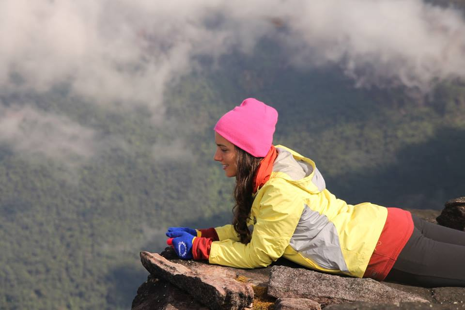

# hw01
Repository for homework 1

#**About Me**
I was born in Miami, FL and now live in Chicago, IL where I am pursuing an MA degree in Social Science. My mother was born in Bolivia and my father was born in the US I grew up speaking Spanish at home with my three siblings and parents. Although I was born in the US, I still feel that my Bolivian heritage plays a significant role in the person I am today. Since leaving Miami in 2008, I completed a B.A. in Anthropology in Claremont, CA and have lived in both Brazil and Washington D.C.

#**Research and Professional Experience** 
Upon graduating from college in 2012, I conducted research in Brazil and worked for a nonprofit organization that centered on indigenous land rights and the environment. In D.C. I worked for a small consulting firm on public health issues randing from malaria in the Amazon to breast cancer in the US.

#**Next Steps** 
I am not sure what I want to focus on next as I still have many interests. Some of these include:

* Public Health
* Indigenous Peoples
* Climate Change
* Substance Abuse
* Maternal and Child Health
* Migration

