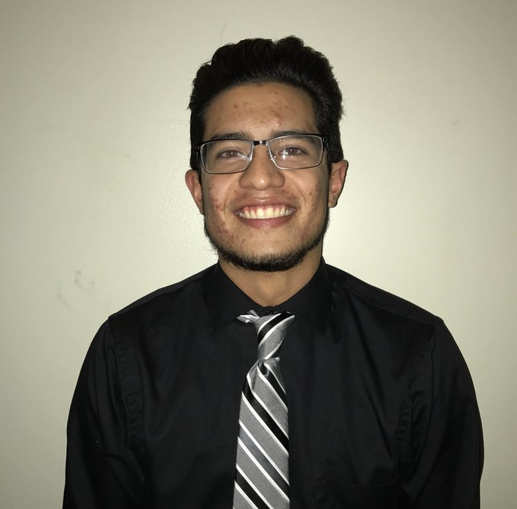

# A Biography of Diego Cardenas

### Basic Information
I am a **fourth-year sociology major** in the college, and I was born and raised in **Phoenix, Arizona.** I want to go to graduate school some day to pursue a PhD in **Sociology**, but I plan on taking a few gap years for now. I'm not a big fan of extremely hot and dry weather, but it's not like I like Chicago's winters either.

### How I look

### Interests Inside and Outside the Classroom

Some of my interests include the following:

* Playing and watching basketball.
* Conducting sociological research.
* Reading about urban sociology and ethnography.
* Listening to music.
* Hiking.
* Doing community service.

Here's a cool look at a project I did for an urbanism/urban sociology class that I took here: [Mapping Little Village](https://hoodmapping.org/little-village/)

