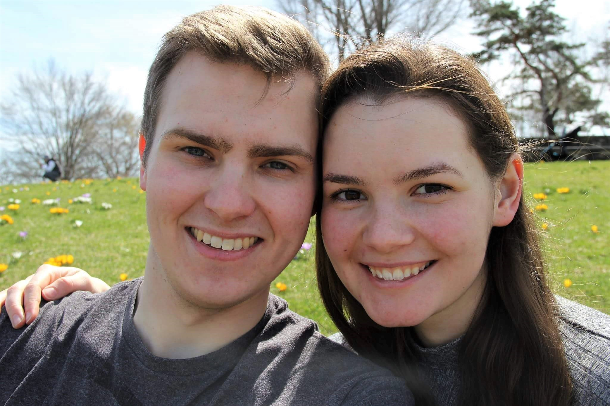
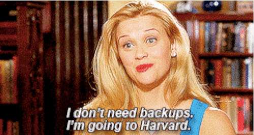
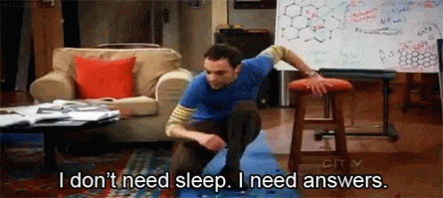
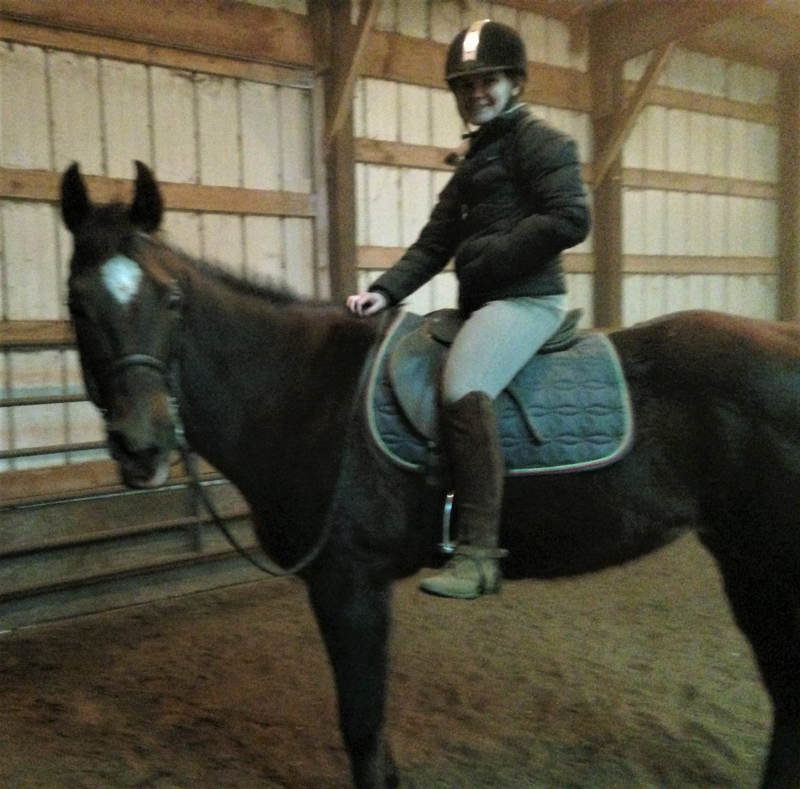

# HW01
## Katherine M. Surma
### About Me

I am a joint-degree BA/MA student at the University of Chicago. I am earning my BA in Political Science and Law, Letters, & Society, and I am completing my Master's degree through the [Master of Arts Program in the Social Sciences](https://mapss.uchicago.edu/node).  

### Research Interests

* American politics
* Misinformation 
* Voter Preference

### Career Interests

I *hope* to attend law school to become a federal prosecutor. 

*However*, I have really enjoyed my time in MAPSS and am therefore also considering pursuing a PhD in Political Science. 

### Personal Life 

I really love to horseback ride and try to spend time in the saddle whenever I'm not on campus.

 

